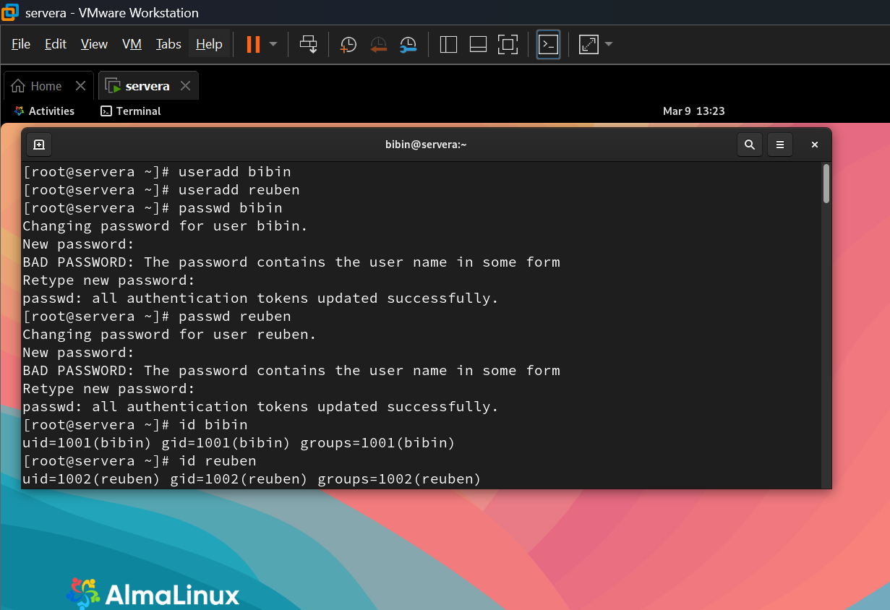
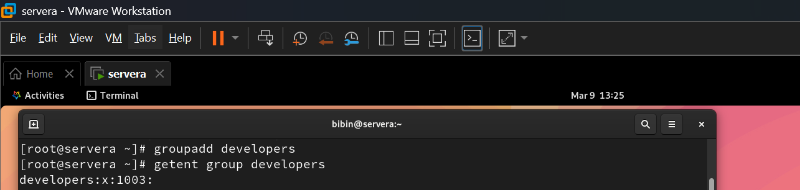

# RHCSA-User-Permission-Management
RHCSA lab project demonstrating Linux user management, groups, permissions, ACLs, sudo (wheel group), password aging, and umask using AlmaLinux.

# Lab Environment

| Component | Details |
|---|---|
| OS | AlmaLinux / RHEL |
| Shell | Bash |
| Users | bibin, reuben |
| Directory | /projects |

---

# Project Objectives

- Create and manage users
- Create and manage groups
- Configure shared directories
- Manage Linux permissions
- Configure special permissions (SGID)
- Configure ACL
- Configure password aging
- Configure sudo using wheel group
- Configure default file permissions using umask

---

# Step 1 — Create Users

Create two users.

```bash
useradd bibin
useradd reuben
```

Set passwords.

```bash
passwd bibin
passwd reuben
```

Verify users.

```bash
id bibin
id reuben
```

Screenshot:  



---

# Step 2 — Create Group

Create a group called **developers**.

```bash
groupadd developers
```

Verify group.

```bash
getent group developers
```

Screenshot:  
 

---

# Step 3 — Add Users to Group

Add users to developers group.

```bash
usermod -aG developers bibin
usermod -aG developers reuben
```

Verify membership.

```bash
id bibin
id reuben
```

Screenshot:  
`screenshots/group_membership.png` 

---

# Step 4 — Create Shared Directory

Create a shared directory.

```bash
mkdir /projects
```

Change group ownership.

```bash
chown :developers /projects
```

Set permissions.

```bash
chmod 770 /projects
```

Verify.

```bash
ls -ld /projects
```

Screenshot:  
`screenshots/directory_permissions.png`

---

# Step 5 — Enable SGID

Enable SGID so files inherit group ownership.

```bash
chmod g+s /projects
```

Verify.

```bash
ls -ld /projects
```

Expected output example:

```
drwxrws---
```

Screenshot:  
`screenshots/sgid_permission.png`

---

# Step 6 — Test File Creation

Switch to user **bibin**.

```bash
su - bibin
```

Create a file.

```bash
touch /projects/project1.txt
```

Verify.

```bash
ls -l /projects
```

Screenshot:  
`screenshots/file_creation.png`

---

# Step 7 — Configure ACL

Switch to root and create a file.

```bash
touch /projects/design.txt
```

Give **reuben read permission**.

```bash
setfacl -m u:reuben:r /projects/design.txt
```

Verify ACL.

```bash
getfacl /projects/design.txt
```

Screenshot:  
`screenshots/acl_permission.png`

---

# Step 8 — Configure Password Aging

Check current password policy.

```bash
chage -l reuben
```

Set password aging.

```bash
chage -m 5 -M 90 -W 7 reuben
```

Verify again.

```bash
chage -l reuben
```

Screenshot:  
`screenshots/password_aging.png`

---

# Step 9 — Configure Sudo Using Wheel Group

Edit sudo configuration.

```bash
visudo
```

Ensure this line is enabled:

```
%wheel ALL=(ALL) ALL
```

Add user **bibin** to wheel group.

```bash
usermod -aG wheel bibin
```

Verify.

```bash
id bibin
```

Screenshot:  
`screenshots/sudo_using_wheel_group1.png`
`screenshots/sudo_using_wheel_group2.png`

---

# Step 10 — Verify Sudo Access

Switch to user.

```bash
su - bibin
```

Become root using sudo.

```bash
sudo -i
```

Verify.

```bash
whoami
```

Expected output:

```
root
```

# Step 11 — Configure umask

Check current umask.

```bash
umask
```

Set a new mask.

```bash
umask 027
```

Create test file.

```bash
touch umask_test.txt
ls -l umask_test.txt
```

Screenshot:  
`screenshots/umask_test1.png`
`screenshots/umask_test2.png`

---

# Useful Commands Used

```
useradd
usermod
groupadd
chmod
chown
setfacl
getfacl
chage
visudo
umask
```
# Conclusion

This lab demonstrates core Linux system administration tasks related to user and permission management. By completing this project on AlmaLinux, I gained practical experience with user accounts, groups, file permissions, ACLs, password policies, and sudo configuration—key skills required for the RHCSA certification and real-world Linux administration.

---
